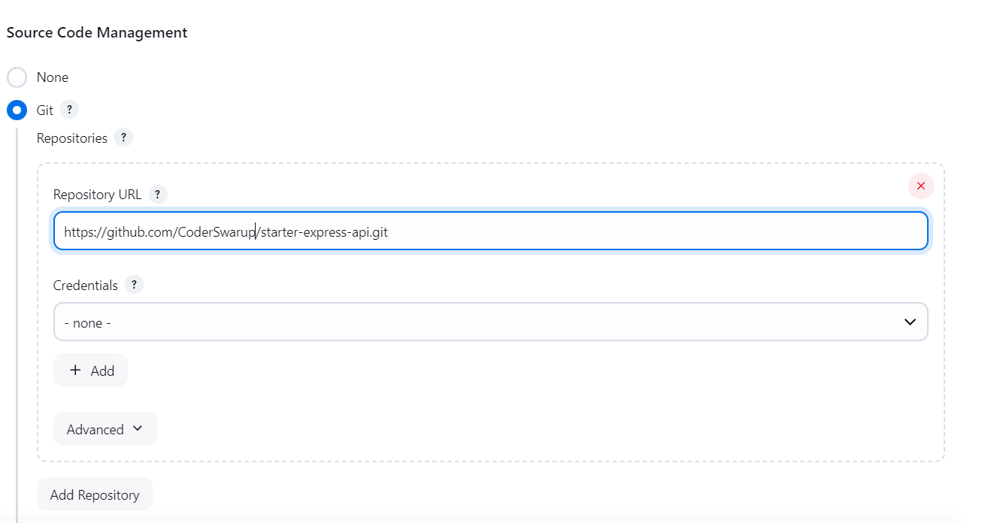
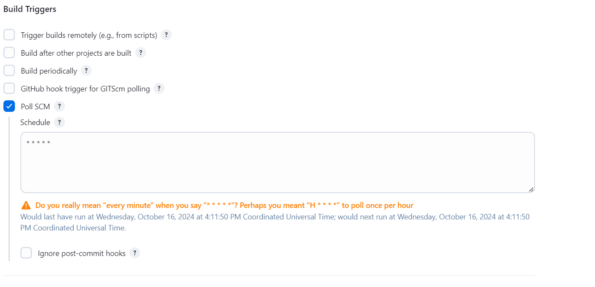
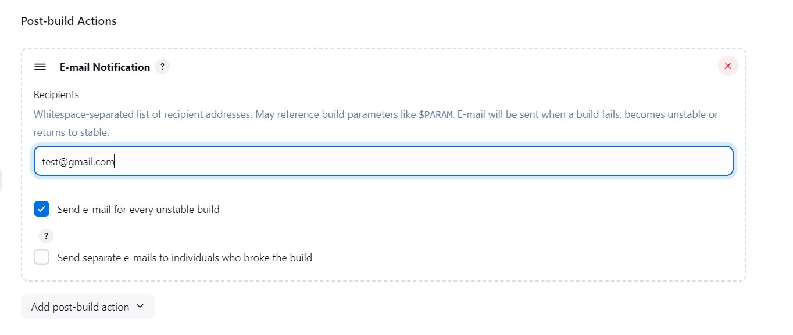
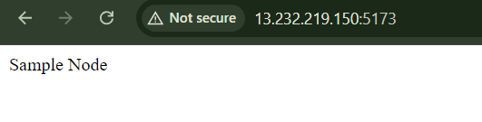

# Jenkins CI/CD Pipeline with Ansible, Docker & GitHub

## Project Overview

This project demonstrates a Continuous Integration and Continuous Deployment (CI/CD) pipeline using Jenkins, Ansible, Docker, and GitHub. The architecture consists of two EC2 servers:

1. **EC2 Server 1 (Master)**: Hosts Jenkins and Ansible, responsible for fetching code from GitHub, running Ansible playbooks, and managing Docker on the worker node.
2. **EC2 Server 2 (Worker Node)**: Hosts Docker, where the application is built and deployed within a Docker container, managed by Ansible from Server 1.

## Architecture

The CI/CD pipeline architecture consists of the following components:

### EC2 Server 1 (Master)

- **Jenkins**: Automates tasks such as fetching code from GitHub and triggering the deployment process.
- **Ansible**: Manages the Docker environment on the worker node, handles tasks such as code deployment, image creation, and container lifecycle management.

### EC2 Server 2 (Worker Node)

- **Docker**: Used for creating and running Docker containers that host the application. Docker images are built based on the code fetched from GitHub.

### GitHub Repository

- The application code is stored in a GitHub repository. Jenkins pulls the latest code from the repository when changes are pushed.

## Workflow

1. **Code Fetching**: Jenkins on Server 1 fetches the latest code from the GitHub repository whenever a new commit is pushed.
2. **Ansible Execution**: Jenkins triggers an Ansible playbook to manage Docker on Server 2 (Worker Node). The playbook:

   - Copies the code from Server 1 to Server 2.
   - Creates a Docker image based on the fetched code.
   - Terminates any running containers from a previous deployment.
   - Starts a new Docker container using the newly created image.

3. **Deployment**: Once the new container is up and running, the application is accessible.

## Architecture Diagram


---

## Detailed Steps

# Step 1 Install the Ansible Both Server

```sh
$ sudo apt update
$ sudo apt install software-properties-common
$ sudo add-apt-repository --yes --update ppa:ansible/ansible
$ sudo apt install ansible

# Verify the Installation
$ ansible --version
```

## Setup Passwordless SSH Authentication

To allow the Ansible server to connect to the target server without requiring a password, follow these steps:

### 1. Generate SSH Key Pair on Ansible Server

On the Ansible server, generate an SSH key pair:

```sh
ssh-keygen
```

### 2. Copy Public Key to Target Server

Navigate to the SSH directory on the Ansible server:

```sh
cd ~/.ssh
cat id_ed25519.pub  # or `cat id_rsa.pub` depending on your key type
```

Copy the output (the public key) to the clipboard.

### 3. Paste the Public Key on the Target Server

On the target server, navigate to the SSH directory and open the `authorized_keys` file:

```sh
cd ~/.ssh
vim authorized_keys
```

Paste the Ansible server's public key into this file.

### 4. Test SSH Connection

Now, from the Ansible server, try connecting to the target server using SSH:

```sh
ssh <private_ip>
```

You should have access without needing a password.

## Create a inventory File and Test The Command On The Contoller Server

1. Create a directory for Ansible files:

   ```sh
   mkdir ~/ansible
   cd ~/ansible
   ```

2. Create a new inventory file:

   ```sh
   nano inventory
   ```

3. Add your target servers to the inventory file, one per line:

   ```plaintext
   [prod-server]
   <YOUR_WORKER_SERVER_PRIVATE_IP>
   ```

4. Validate your inventory:

   ```sh
   ansible-inventory -i inventory --list
   ```

5. Run the Baic Command

`to display information about disk space usage`

```sh
ansible -i inventory prod-server -m "shell" -a "df"


```

---

# Step 2 Install the Jenkins On the Master Server

Pre-Requisites:

- Java (JDK)

### Run the below commands to install Java and Jenkins

Install Java

```
sudo apt update
sudo apt install openjdk-17-jre
```

Verify Java is Installed

```
java -version
```

Now, you can proceed with installing Jenkins

```
curl -fsSL https://pkg.jenkins.io/debian/jenkins.io-2023.key | sudo tee \
  /usr/share/keyrings/jenkins-keyring.asc > /dev/null
echo deb [signed-by=/usr/share/keyrings/jenkins-keyring.asc] \
  https://pkg.jenkins.io/debian binary/ | sudo tee \
  /etc/apt/sources.list.d/jenkins.list > /dev/null
sudo apt-get update
sudo apt-get install jenkins
```

**Note: ** By default, Jenkins will not be accessible to the external world due to the inbound traffic restriction by AWS. Open port 8080 in the inbound traffic rules as show below.

- EC2 > Instances > Click on <Instance-ID>
- In the bottom tabs -> Click on Security
- Security groups
- Add inbound traffic rules as shown in the image (you can just allow TCP 8080 as well, in my case, I allowed `All traffic`).


### Login to Jenkins using the below URL:

http://<ec2-instance-public-ip-address>:8080 [You can get the ec2-instance-public-ip-address from your AWS EC2 console page]

Note: If you are not interested in allowing `All Traffic` to your EC2 instance 1. Delete the inbound traffic rule for your instance 2. Edit the inbound traffic rule to only allow custom TCP port `8080`

After you login to Jenkins, - Run the command to copy the Jenkins Admin Password - `sudo cat /var/lib/jenkins/secrets/initialAdminPassword` - Enter the Administrator password


### Click on Install suggested plugins


Wait for the Jenkins to Install suggested plugins


Create First Admin User or Skip the step [If you want to use this Jenkins instance for future use-cases as well, better to create admin user]


Jenkins Installation is Successful. You can now starting using the Jenkins


---

# Step 3. Install Docker on the Worker Node

Run the below command to Install Docker

```
sudo apt update
sudo apt install docker.io
```

Run the `docker ps` Command You Got an Error

```sh
$ docker ps
permission denied while trying to connect to the Docker daemon socket at unix:///var/run/docker.sock: Get "http://%2Fvar%2Frun%2Fdocker.sock/v1.24/containers/json": dial unix /var/run/docker.sock: connect: permission denied
```

#### How to Resolve This Error

Create the Docker Group (if it doesn't already exist):

```sh
sudo groupadd docker
```

Add Your User to the Docker Group: Replace `your-username` with your actual username:

```sh
sudo usermod -aG docker $USER
```

Apply the Changes: Log out and log back in for the group changes to take effect. Alternatively, you can run:

```sh
newgrp docker
```

Check If It Works: Try running the `docker ps` command again:

```sh
$ docker ps
CONTAINER ID   IMAGE     COMMAND   CREATED   STATUS    PORTS     NAMES
```

Check the Same Command From the Master Server using the Ansible

```sh
cd ansible

$ ansible -i inventory prod-server -m "shell" -a "docker ps"
[WARNING]: Invalid characters were found in group names but not replaced, use
-vvvv to see details
[WARNING]: Platform linux on host ubuntu@ip-172-31-11-163 is using the
discovered Python interpreter at /usr/bin/python3.12, but future installation
of another Python interpreter could change the meaning of that path. See
https://docs.ansible.com/ansible-
core/2.17/reference_appendices/interpreter_discovery.html for more information.
ubuntu@ip-172-31-11-163 | CHANGED | rc=0 >>
CONTAINER ID   IMAGE     COMMAND   CREATED   STATUS    PORTS     NAMES
```

🚀 congratulations Your Intsallation Step Completed

---

## Jenkins Integration with Ansible

This guide outlines how to integrate Jenkins with Ansible to automate deployment and configuration tasks, including a sample playbook.

#### 1. Install Required Plugins in Jenkins

1. Log in to Jenkins.
2. Navigate to **Manage Jenkins** > **Manage Plugins**.
3. Go to the **Available** tab, search for and install the following plugins:
   - **Ansible plugin**: Allows Jenkins to run Ansible playbooks.
   - **Credentials Binding Plugin**: Helps manage credentials securely in Jenkins jobs.

#### 2. Configure Ansible Plugin in Jenkins

1. Go to **Manage Jenkins** > **Configure System**.
2. Scroll down to the **Ansible** section.
3. Configure the following:
   - **Name**: Enter a name for the Ansible installation (e.g., `ansible`).
   - **Path to ansible executable**: Provide the path to the Ansible executable (`ansible-playbook`). Ensure it's in the system PATH.
   - **Credentials**: Add credentials for accessing your target servers (SSH keys or username/password).

#### 3. Sample Ansible Playbook

Create a sample Ansible playbook (`playbook.yml`)

```yaml
- name: For the Testing
  hosts: prod-server
  tasks:
    - name: Copy File
      copy:
        src: /home/ubuntu/ansible/playbook.yaml
        dest: /home/ubuntu/project
```

##### 4. Try the Follwoing Command In CMD

```sh
ansible-playbook -i ~/ansible/inventory ~/ansible/playbook.yaml
```

##### 5 But Whe Try With the Ansible Plugin in the Jenkins

`You got This Error`

```sh
fatal: [ubuntu@ip-172-31-11-163]: UNREACHABLE! => {"changed": false, "msg": "Failed to connect to the host via ssh: Host key verification failed.", "unreachable": true}

```

##### 6. How To resolve

```sh
# Master
sudo cat /etc/passwd

# Getting na jenkins:x:111:113:Jenkins,,,:/var/lib/jenkins:/bin/bash

------------------------

# Worker
 sudo cat /etc/passwd

# YOu got no any Jenkins USer
sudo useradd jenkins
sudo cat /etc/passwd
# jenkins:x:1001:1001::/home/jenkins:/bin/sh

sudo passwd jenkins # jenkins

------------------------

# Master
sudo su -s /bin/bash jenkins  # switch user to the Jenkins
# jenkins@ip-172-31-13-100:/$ YOUR NEW TERMINAL


## Now Task same as the coy and Paste the Jenkins ssh
ssh-keygen

```

##### 7 If Still got the Error

`jenkins@ip-172-31-11-188: Permission denied (publickey).`

Follow this Guide
[jenkins_ssh_troubleshooting](jenkins_ssh_troubleshooting.md)

# Now Your Ready to Create Your CICD Pipiline

### 1. Create a Folder in `/var/lib/jenkins/` directory Called `ansiblefiles`

`inventory`

```yaml
[prod-server]
ubuntu@ip-172-31-11-163
```

`playbook.yaml`

```yaml
---
- name: Deploy Web Application
  hosts: prod-server
  become: true
  vars:
    image_name: nodejs_app_image
    container_name: nodejs_app_container
  tasks:
    - name: Copy Github Repo
      copy:
        src: /var/lib/jenkins/workspace/CICD_Project/
        dest: /home/ubuntu/project

    - name: Ensure Docker is installed
      package:
        name: docker.io
        state: present

    - name: Remove existing Docker container (if exists)
      shell: |
        docker rm -f {{ container_name }} || true
      ignore_errors: yes # This will continue even if the command fails

    - name: Remove existing Docker image (if exists)
      shell: |
        docker images --format "{{.Repository}}" | grep {{ image_name }} && docker rmi {{ image_name }} || true
      ignore_errors: yes # This will continue even if the command fails

    - name: Build new Docker image
      command: docker build -t {{ image_name }} .
      args:
        chdir: /home/ubuntu/project

    - name: Run new Docker container
      command: docker run -it -d --name {{ container_name }} -p 5173:3000 {{ image_name }}
```

### 2. Create a FreeStyle Project in the Jenkins

Add Your Repo link



Create a build trigger



`Build Step` Invoke Ansible Playbook


Add The Email



## 3. Project is Ready To Go 🚀🚀🚀🚀



## 4. IF any Error

[Error Mail](ErrorEmail.md)

### Drawbacks of the Architecture

1. **No Rollback Capability**: Without stored images, rolling back to a previous stable version is impossible, leading to increased downtime during failures.

2. **Increased Downtime**: If the build fails, the application goes completely down, which can disrupt user experience and service availability.

3. **Lack of Versioning**: Not storing built images makes it difficult to track application versions, complicating debugging and auditing processes.

4. **Resource Inefficiency**: Rebuilding the application from scratch for every deployment consumes more resources and increases build times.

5. **Inconsistent Environments**: Changes in the environment between builds can lead to inconsistencies, causing unpredictable behavior in different deployments.

# Thanks 😍💖👨🏻‍💻
