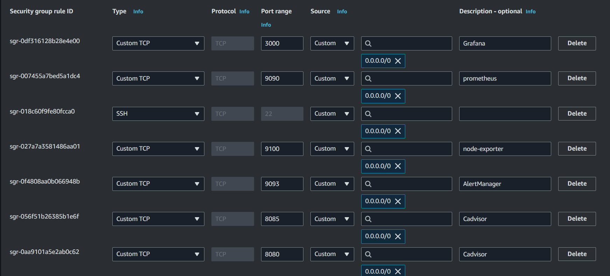
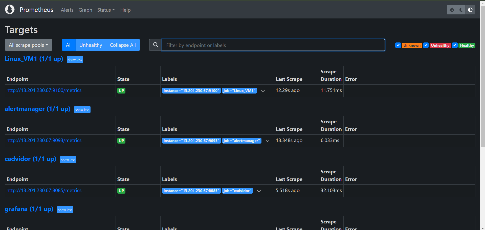

# Prometheus Grafana Node-Exporter Cadvisor AlertManager Docker Monitoring

This project focuses on creating a comprehensive monitoring solution for Docker containers using a powerful stack of open-source tools. The solution provides real-time insights into system performance, container metrics, and resource usage. It allows you to set up alerting rules to respond to critical situations, ensuring the health and reliability of your infrastructure

## Components:

### Prometheus:

Prometheus serves as the core of the monitoring stack, scraping metrics from various services and storing time-series data. It pulls metrics from Node-Exporter and cAdvisor at regular intervals, allowing for high granularity data collection. Prometheus is responsible for querying and storing the data, which can later be visualized in Grafana.

### Grafana:

Grafana provides a rich visualization layer for the metrics collected by Prometheus. It enables the creation of custom dashboards that display real-time metrics such as CPU, memory usage, disk I/O, network performance, and container-specific statistics. Grafana’s flexibility allows you to create alerts, which can be triggered based on Prometheus data.

### Node-Exporter:

Node-Exporter is responsible for gathering and exposing host-level metrics, including CPU usage, memory, disk, and network statistics. These metrics help monitor the performance and resource utilization of the underlying system running Docker containers.

### cAdvisor (Container Advisor):

cAdvisor is a specialized tool designed to monitor Docker containers. It collects container-specific metrics, such as CPU, memory usage, network bandwidth, and disk usage. By integrating cAdvisor with Prometheus, it becomes possible to monitor individual containers in a granular manner.

### AlertManager:

AlertManager works with Prometheus to handle alerts generated by user-defined rules. It manages alert notifications, silencing, grouping, and routing alerts to various channels like email, Slack, or other messaging services. This ensures that you are immediately notified when critical issues arise in the system.

# Create a EC2 Instance and Add the Following InBoud Rules



# Step 1. Install Docker

Run the below command to Install Docker

```
sudo apt update
sudo apt install docker.io
```

Run the `docker ps` Command You Got an Error

```sh
$ docker ps
permission denied while trying to connect to the Docker daemon socket at unix:///var/run/docker.sock: Get "http://%2Fvar%2Frun%2Fdocker.sock/v1.24/containers/json": dial unix /var/run/docker.sock: connect: permission denied
```

#### How to Resolve This Error

Create the Docker Group (if it doesn't already exist):

```sh
sudo groupadd docker
```

Add Your User to the Docker Group: Replace `your-username` with your actual username:

```sh
sudo usermod -aG docker $USER
```

Apply the Changes: Log out and log back in for the group changes to take effect. Alternatively, you can run:

```sh
newgrp docker
```

Check If It Works: Try running the `docker ps` command again:

```sh
$ docker ps
CONTAINER ID   IMAGE     COMMAND   CREATED   STATUS    PORTS     NAMES
```

# Step 2. Run the Prometheus Container With the Configuration File

create a `/ect/prometheus` Directory

```sh
sudo mkdir -p /etc/prometheus
```

Change the Permission

```sh
sudo chmod 775 -R /etc/prometheus/
```

create a `prometheus.yml` File in `/etc/prometheus/`

```yml
# Global Config
global:
  scrape_interval: 15s
  evaluation_interval: 15s
  scrape_timeout: 10s

# Alertmanager configuration
alerting:
  alertmanagers:
    - static_configs:
        - targets: ["<< add your pubic ip>>:9093"]

rule_files:
  - alert_rules.yml
#to monitor prometheus itself or any other end points
scrape_configs:
  - job_name: "prometheus"
    static_configs:
      - targets: ["<< add your pubic ip>>:9090"]
  - job_name: "alertmanager"
    static_configs:
      - targets: ["<< add your pubic ip>>:9093"]
  - job_name: "nodeExporter"
    static_configs:
      - targets: ["<< add your pubic ip>>:9100"]
  - job_name: "cadvidor"
    static_configs:
      - targets: ["<< add your pubic ip>>:8080"]
  - job_name: "grafana"
    static_configs:
      - targets: ["<< add your pubic ip>>:3000"]
  #to monitor your VM/server
  - job_name: "Linux_VM1"
    static_configs:
      - targets: ["<< add your pubic ip>>:9100"]
```

Run the Container

```sh
docker run -d --name prometheus --restart always -p 9090:9090 -v /etc/prometheus:/etc/prometheus/ prom/prometheus
```

> 👉 Access URL : http://<YOUR_EC2_PUBLIC_IP>:9090/



# Step 3. Node Exporter Installation

run the Node Exporter Container

```sh
docker run -p 9100:9100 -d --restart always --name node-exporter prom/node-exporter
```

> 👉 Access URL : http://<YOUR_EC2_PUBLIC_IP>:9100/


# Step 4. Cadvisor Installation

run the Container

```sh
sudo docker run -it -d --volume=/:/rootfs:ro  --volume=/var/run:/var/run:rw  --volume=/sys:/sys:ro  --volume=/var/lib/docker/:/var/lib/docker:ro  --publish=8085:8080  --detach=true  --name=cadvisor  gcr.io/cadvisor/cadvisor:latest
```

> 👉 Access URL : http://<YOUR_EC2_PUBLIC_IP>:8085/


# Step 4. Install Grafana

run the Continer

```sh
docker run -d --restart always --name grafana -p 3000:3000 -v "grafana_new:/var/lib/grafana" grafana/grafana
```

> 👉 Access URL : http://<YOUR_EC2_PUBLIC_IP>:3000/

# Step 5: Alert Manager Installation

create a `alert_rules.yml` int `/etc/prometheus`

```yml
groups:
  - name: targets
    rules:
      - alert: monitor_service_down
        expr: up == 0
        for: 30s
        labels:
          severity: critical
        annotations:
          summary: "Monitor service non-operational"
          description: "Service {{ $labels.job }} is down."

  - name: host
    rules:
      - alert: high_memory_load
        expr: (sum(node_memory_MemTotal_bytes) - sum(node_memory_MemFree_bytes + node_memory_Buffers_bytes + node_memory_Cached_bytes) ) / sum(node_memory_MemTotal_bytes) * 100 > 85
        for: 30s
        labels:
          severity: warning
        annotations:
          summary: "Server memory is almost full"
          description: "Docker host memory usage is {{ humanize $value}}%. Reported by instance {{ $labels.instance }} of job {{ $labels.job }}."

  - name: host_2
    rules:
      - alert: high_memory_load
        expr: (sum(node_memory_MemTotal_bytes) - sum(node_memory_MemFree_bytes + node_memory_Buffers_bytes + node_memory_Cached_bytes) ) / sum(node_memory_MemTotal_bytes) * 100 > 90
        for: 30s
        labels:
          severity: critical
        annotations:
          summary: "Server memory is almost full"
          description: "Docker host memory usage is {{ humanize $value}}%. Reported by instance {{ $labels.instance }} of job {{ $labels.job }}."
```

create a `alertmanager.yml` file in `/etc/prometheus`

```yml
route:
  group_by: ["job"]
  group_wait: 30s
  group_interval: 5m
  repeat_interval: 1h
  receiver: "tech-email"
  routes:
    - match:
        alertname: target
        receiver: "null"

receivers:
  - name: "tech-email"
    email_configs:
      - to: "<< add your email here >>"
        from: "<< add your email here >>"
        auth_username: << add your encrypted username here>>
        auth_password: << add your encrypted password here>>
        require_tls: false
        smarthost: "<< add your smtp host here >>:465"
        send_resolved: true
  - name: "null"
```

run the conatiner

```sh
docker run --name alertmanager -d -p 9093:9093 -v /etc/prometheus/:/etc/alertmanager quay.io/prometheus/alertmanager
```

> 👉 Access URL : http://<YOUR_EC2_PUBLIC_IP>:9093/


## Setup DashBoard

1. Add the New Data Source prometheus

2. For Dashboard Templates Go to 👉 [grafana Dashboards](https://grafana.com/grafana/dashboards/)

   1. Select The Node Exporter DashBoard [Node Exporter](https://grafana.com/grafana/dashboards/15172-node-exporter-for-prometheus-dashboard-based-on-11074/)
      ID :11074
      

   2. Search The docker Dashboard [Docker And System Monitoring](https://grafana.com/grafana/dashboards/893-main/)
      ID : 893
      

---

# Key Features

### Real-Time Monitoring:

Monitor CPU, memory, disk, and network usage at both the host and container levels.

### Custom Dashboards:

Create Grafana dashboards to visualize metrics in an intuitive and customizable manner.

### Alerting System:

Set up alerting rules in Prometheus and receive notifications via AlertManager when thresholds are breached.

### Container Management:

Monitor Docker containers in detail, understanding their resource consumption and performance bottlenecks.

# Thanks 👨🏻‍💻🚀💖
