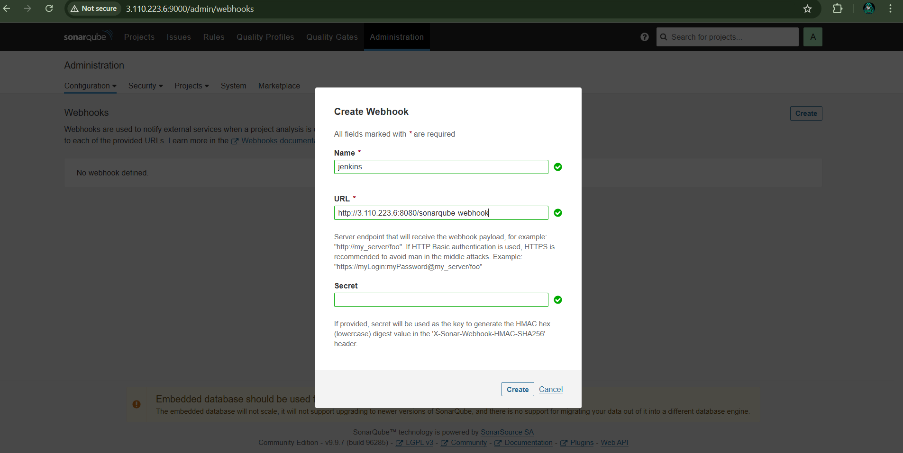
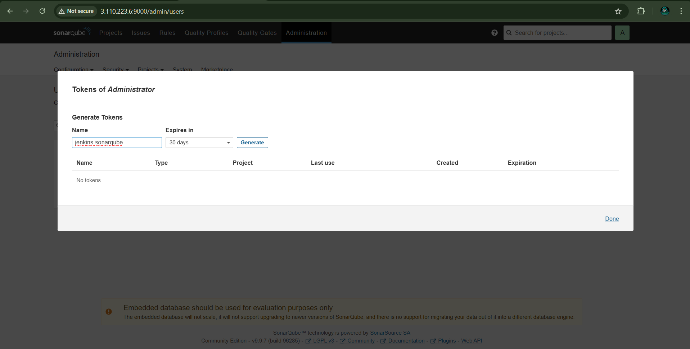
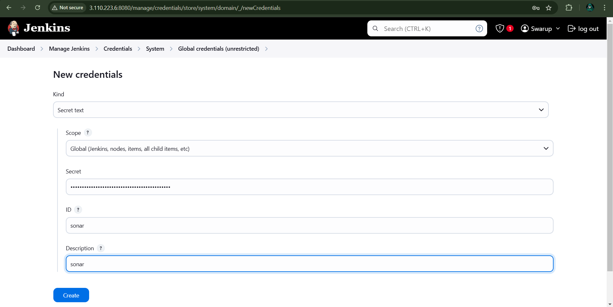
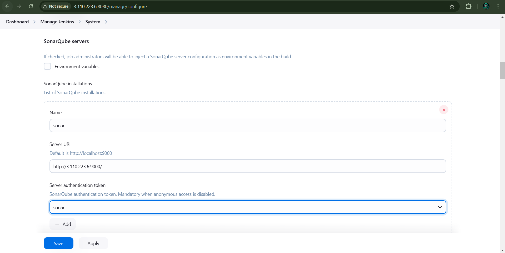
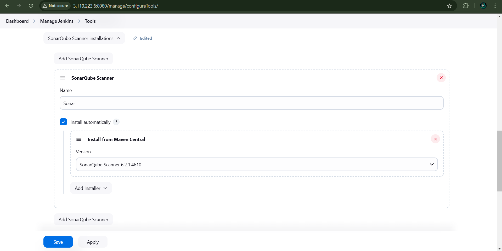
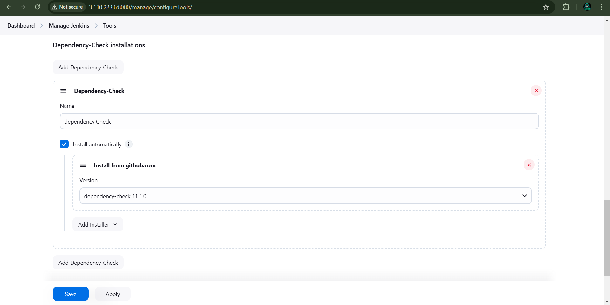
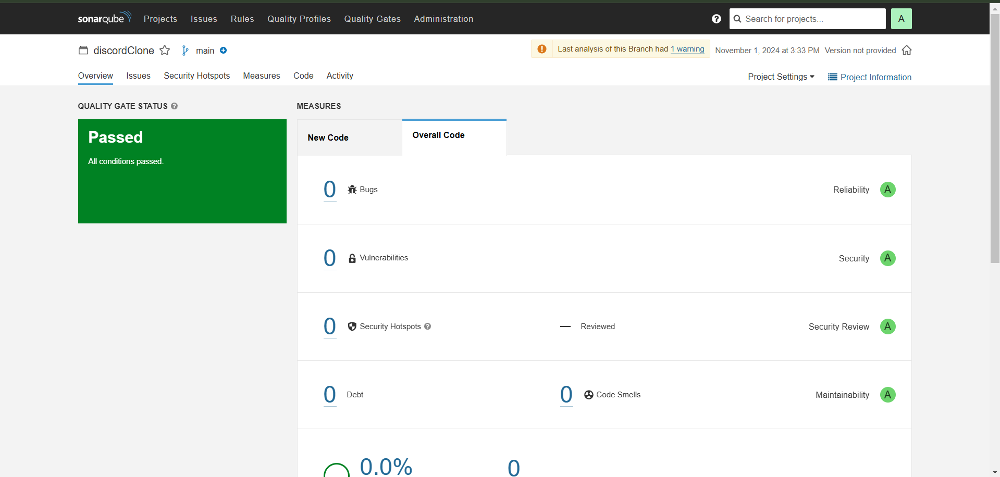

# DevSecOps End to End CICD Project | SonarQube + OWASP + Trivy + Docker + Jenkins

# Create an EC2 Instance (t2.medium)

## Step 1: Sign in to AWS

- Go to the [AWS Management Console](https://aws.amazon.com/).
- Sign in with your AWS credentials.

## Step 2: Open EC2 Dashboard

- Select **EC2** from the **Services** menu.

## Step 3: Launch an Instance

- Click on **Launch Instance**.

## Step 4: Choose AMI

- Select an Amazon Machine Image (AMI) (e.g., Amazon Linux 2 or Ubuntu).
- Click **Select**.

## Step 5: Choose Instance Type

- Select **t2.medium** (2 vCPUs, 4 GB Memory).
- Click **Next: Configure Instance Details**.

## Step 6: Configure Instance Details

- Choose the number of instances and configure network settings.
- Click **Next: Add Storage**.

## Step 7: Add Storage

- Ensure root volume size meets your requirements (default is usually 8 GB).
- Optionally add more storage if needed.
- Click **Next: Add Tags**.

## Step 8: Add Tags (Optional)

- Add tags for better resource management (e.g., `Name: MyEC2Instance`).
- Click **Next: Configure Security Group**.

## Step 9: Configure Security Group

- Create or select a security group.
- Allow inbound traffic (e.g., SSH on port 22).
- Click **Review and Launch**.

## Step 10: Launch Instance

- Review configuration and click **Launch**.
- Select or create a key pair and download it.
- Click **Launch Instances**.

## Step 11: Connect to Your Instance

- After the instance is running, select it and click **Connect** for SSH access instructions.

# Install the Jenkins On the Server

Pre-Requisites:

- Java (JDK)

### Run the below commands to install Java and Jenkins

Install Java

```
sudo apt update
sudo apt install openjdk-17-jre
```

Verify Java is Installed

```
java -version
```

Now, you can proceed with installing Jenkins

```
curl -fsSL https://pkg.jenkins.io/debian/jenkins.io-2023.key | sudo tee \
  /usr/share/keyrings/jenkins-keyring.asc > /dev/null
echo deb [signed-by=/usr/share/keyrings/jenkins-keyring.asc] \
  https://pkg.jenkins.io/debian binary/ | sudo tee \
  /etc/apt/sources.list.d/jenkins.list > /dev/null
sudo apt-get update
sudo apt-get install jenkins
```

**Note: ** By default, Jenkins will not be accessible to the external world due to the inbound traffic restriction by AWS. Open port 8080 in the inbound traffic rules as show below.

- EC2 > Instances > Click on <Instance-ID>
- In the bottom tabs -> Click on Security
- Security groups
- Add inbound traffic rules (you can just allow TCP 8080 as well, in my case, I allowed `All traffic`).

# Install Docker

Run the below command to Install Docker

```
sudo apt update
sudo apt install docker.io -y
sudo apt install docker-compose -y
```

Run the `docker ps` Command You Got an Error

```sh
$ docker ps
permission denied while trying to connect to the Docker daemon socket at unix:///var/run/docker.sock: Get "http://%2Fvar%2Frun%2Fdocker.sock/v1.24/containers/json": dial unix /var/run/docker.sock: connect: permission denied
```

#### How to Resolve This Error

Create the Docker Group (if it doesn't already exist):

```sh
sudo groupadd docker
```

Add Your User to the Docker Group: Replace `your-username` with your actual username:

```sh
sudo usermod -aG docker $USER
```

Apply the Changes: Log out and log back in for the group changes to take effect. Alternatively, you can run:

```sh
newgrp docker
```

Check If It Works: Try running the `docker ps` command again:

```sh
$ docker ps
CONTAINER ID   IMAGE     COMMAND   CREATED   STATUS    PORTS     NAMES
```

# Install SonarQube

```sh
 docker run -it -d --name sonarqube-server -p 9000:9000 sonarqube:lts-community
```

- Security groups
- Add inbound traffic rules (you can just allow TCP 9000 as well, in my case, I allowed `All traffic`).

> Note : Login default username password is `admin`

# Trivy_Installation_and_implementation

<details><summary><b>Install Trivy</b></summary>
  
```bash
sudo apt-get install wget apt-transport-https gnupg lsb-release
```

```bash
wget -qO - https://aquasecurity.github.io/trivy-repo/deb/public.key | gpg --dearmor | sudo tee /usr/share/keyrings/trivy.gpg > /dev/null
```

```bash
echo "deb [signed-by=/usr/share/keyrings/trivy.gpg] https://aquasecurity.github.io/trivy-repo/deb $(lsb_release -sc) main" | sudo tee -a /etc/apt/sources.list.d/trivy.list
```

```bash
sudo apt-get update
```

```bash
sudo apt-get install trivy
```

</details>

<details><summary><b>Trivy Commands</b></summary>

```bash
trivy image imagename
```

```bash
trivy fs --security-checks vuln,config   Folder_name_OR_Path
```

```bash
trivy image --severity HIGH,CRITICAL image_name
```

```bash
trivy image -f json -o results.json image_name
```

```bash
trivy repo repo-url
```

```bash
trivy k8s --report summary cluster
```

</details>

# Download the Jenkins Plugin

SonarQube Scanner
Sonar Quality Gates
OWASP Dependency-Check
Docker
Pipeline: Stage View

# configure SonarQube , OWASP and Jenkins













# Setting Up SonarQube in Jenkins

Follow these steps to configure SonarQube in Jenkins for successful integration with your Jenkins pipeline.

## Step 1: Configure SonarQube Scanner in Jenkins

1. Go to **Jenkins Dashboard > Manage Jenkins > Global Tool Configuration**.
2. Scroll down to the **SonarQube Scanner** section.
3. Ensure that there is an installation with the name `Sonar`.
4. If there isn’t one, add a new SonarQube installation by clicking **Add SonarQube**:
   - Set **Name** as `Sonar`.
   - Provide any necessary installation details.

## Step 2: Configure SonarQube Server in Jenkins

1. Go to **Jenkins Dashboard > Manage Jenkins > Configure System**.
2. Scroll down to the **SonarQube servers** section.
3. Add a new SonarQube server and ensure it uses the same name, `Sonar`, or matches the name you intend to use in the `withSonarQubeEnv` function in your pipeline script.

   - Ensure all required details (URL, authentication token, etc.) are correctly entered.

## Step 3: Verify SonarQube Installation Name in the Pipeline Script

1. Open your pipeline script and ensure that the name used in `withSonarQubeEnv("Sonar")` matches the name you configured in **SonarQube servers** (in this case, `Sonar`).

```groovy
   withSonarQubeEnv("Sonar") {
       sh '$SONAR_HOME/bin/sonar-scanner -Dsonar.projectName=YourProject -Dsonar.projectKey=your-project-key'
   }
```

## Write The Pipeline

```groovy
pipeline {
    agent any
    environment {
        SONAR_HOME = tool "Sonar"
    }

    stages {
        stage('Clone Code From Github') {
            steps {
                echo 'Fetching the Code'
                git url: "https://github.com/user-name/<repo_name>.git", branch: "main"
            }
        }

        stage('Sonarqube Quality Analysis') {
            steps {
                withSonarQubeEnv("Sonar") {
                    sh '$SONAR_HOME/bin/sonar-scanner -Dsonar.projectName=YourProject -Dsonar.projectKey=your-project-key'
                }
            }
        }

    }
}

```

### You will see the Ouput Of the Sonarqube Scanner



# Setup the Pipeline With The OWASP

```groovy
pipeline {
    agent any
    environment {
        SONAR_HOME = tool "Sonar"
    }

    stages {
        stage('Clone Code From Github') {
            steps {
                echo 'Fetching the Code'
                git url: "https://github.com/user-name/<repo_name>.git", branch: "main"
            }
        }

        stage('Sonarqube Quality Analysis') {
            steps {
                withSonarQubeEnv("Sonar") {
                    sh '$SONAR_HOME/bin/sonar-scanner -Dsonar.projectName=YourProject -Dsonar.projectKey=your-project-key'
                }
            }
        }


        // It Will take Long time as 20min For the First Time so its require t2.large Intance
        stage("OWASP Dependency Check") {
            steps {
                dependencyCheck additionalArguments: '--scan ./', odcInstallation: 'dependency Check' // Match installation name
                dependencyCheckPublisher pattern: '**/dependency-check-report.xml'
            }
        }

        stage("Sonar Quality Gate Scan") {
            steps {
                timeout(time: 2, unit: "MINUTES") {
                    waitForQualityGate abortPipeline: false
                }
            }
        }

        stage('Trivy File System Scan') {
            steps {
                sh 'trivy fs --format table -o trivy-fs-report.html .' // Ensure trivy is accessible
            }
        }

        stage("Deploy using Docker Compose"){
            steps {
                sh 'docker compose up'
            }
        }
    }

}

```

# command to check the space available

```sh
 df --total -h | grep total
```

# Thanks 💖 Happy Coding 👨🏻‍💻
