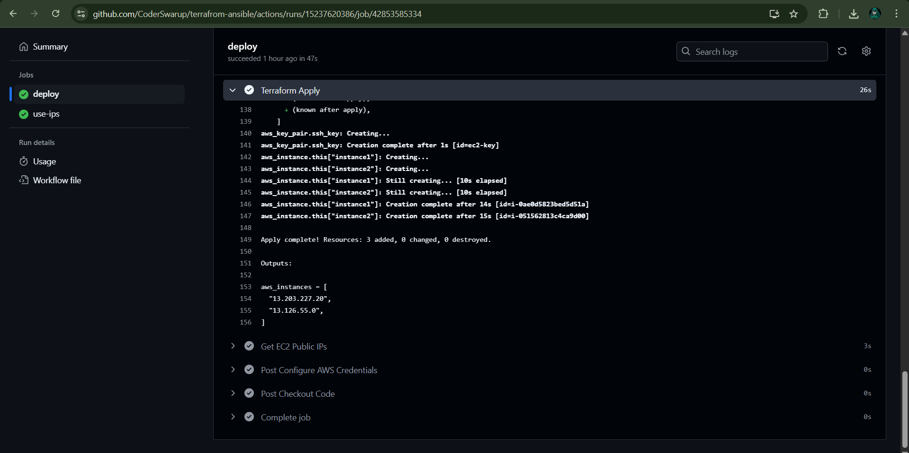

# Deploy EC2 Instances Using Terraform and GitHub Actions

This guide explains how to deploy EC2 instances on AWS using Terraform, integrated with GitHub Actions for automation.



---

## Prerequisites

Before you start, ensure you have the following:

1. **AWS Account**:

   - Create an AWS account if you don't already have one.
   - Generate an access key and secret key for a user with sufficient permissions to create EC2 instances.

2. **Terraform**:

   - Ensure Terraform is installed locally if you want to test the setup manually.

3. **GitHub Repository**:

   - A GitHub repository with a `terraform` folder containing the necessary Terraform configuration files for EC2 deployment.

4. **Secrets**:
   - Add the following secrets in your GitHub repository settings:
     - `AWS_ACCESS_KEY_ID`
     - `AWS_SECRET_ACCESS_KEY`
     - `PUBLIC_KEY` (the public key for your SSH connection to EC2 instances)

---

## Repository Structure

Your repository should be structured as follows:

```
.
├── .github
│   └── workflows
│       └── deploy-ec2.yml  # The GitHub Actions workflow file
├── terraform
│   ├── main.tf             # Terraform configuration file
│   ├── variables.tf        # Define Terraform variables
│   ├── outputs.tf          # Define outputs (e.g., public IPs)
│   └── terraform.tfvars    # Optional: Default variable values
└── README.md               # This documentation file
```

---

## Setting Up Terraform Configuration

In the `terraform` folder:

1. **`main.tf`**:
   Define the resources for creating EC2 instances:

   ```hcl
   provider "aws" {
     region = "ap-south-1"
   }

   resource "aws_instance" "this" {
     ami           = "ami-0c2b8ca1dad447f8a" # Replace with a valid AMI ID
     instance_type = "t2.micro"
     key_name      = var.key_name
     tags = {
       Name = "GitHub-Actions-EC2"
     }
   }
   ```

2. **`variables.tf`**:
   Define variables:

   ```hcl
   variable "key_name" {
     description = "The name of the SSH key pair"
   }
   ```

3. **`outputs.tf`**:
   Output the EC2 public IPs:

   ```hcl
   output "aws_instances" {
     value       = [for instance in aws_instance.this : instance.public_ip]
     description = "List of public IPs of the EC2 instances"
   }
   ```

4. **`terraform.tfvars` (optional)**:
   Provide default values:
   ```hcl
   key_name = "your-key-name"
   ```

---

## GitHub Actions Workflow

Place the following workflow file in `.github/workflows/deploy-ec2.yml`:

```yaml
name: Deploy EC2 with Terraform

on:
  push:
    branches:
      - main
    paths-ignore:
      - "**/README.md"

jobs:
  deploy:
    runs-on: ubuntu-latest
    outputs:
      ec2_public_ips: ${{ steps.output-public-ips.outputs.ec2_public_ips }}
    steps:
      - name: Checkout Code
        uses: actions/checkout@v3

      - name: Setup Terraform
        uses: hashicorp/setup-terraform@v2
        with:
          terraform_version: 1.5.5

      - name: Configure AWS Credentials
        uses: aws-actions/configure-aws-credentials@v3
        with:
          aws-access-key-id: ${{ secrets.AWS_ACCESS_KEY_ID }}
          aws-secret-access-key: ${{ secrets.AWS_SECRET_ACCESS_KEY }}
          aws-region: "ap-south-1"

      - name: Change to Terraform Directory
        working-directory: ./terraform
        run: pwd

      - name: Terraform Init
        working-directory: ./terraform
        run: terraform init

      - name: Terraform Plan
        working-directory: ./terraform
        run: terraform plan -var="key_name=${{ secrets.PUBLIC_KEY }}"

      - name: Terraform Apply
        id: terraform-apply
        working-directory: ./terraform
        run: terraform apply -var="key_name=${{ secrets.PUBLIC_KEY }}" -auto-approve

      - name: Get EC2 Public IPs
        id: output-public-ips
        working-directory: ./terraform
        run: |
          terraform output -json aws_instances > public_ips.json
          PUBLIC_IPS=$(jq -r '.value[]' public_ips.json | tr '
' ' ')
          echo "ec2_public_ips=$PUBLIC_IPS" >> $GITHUB_OUTPUT
```

---

## Deployment Steps

1. **Clone the Repository**:

   ```bash
   git clone https://github.com/CoderSwarup/Devops_Projects.git
   cd 5_Terrafrom-Jenkins-EC2-deployment

   # convert dot-github folder to .github
   ```

2. **Add Secrets**:

   - Navigate to your repository settings on GitHub.
   - Add `AWS_ACCESS_KEY_ID`, `AWS_SECRET_ACCESS_KEY`, and `PUBLIC_KEY`.

3. **Push Changes**:

   - Commit and push your changes to the `main` branch:
     ```bash
     git add .
     git commit -m "Setup EC2 deployment with Terraform"
     git push origin main
     ```

4. **Monitor Workflow**:

   - Go to the "Actions" tab in your repository to monitor the workflow execution.

5. **Access EC2 Instances**:
   - Once the workflow completes, the public IPs of the deployed EC2 instances will be output in the workflow logs.

---

## Verifying Deployment

To SSH into an EC2 instance:

```bash
ssh -i "path-to-your-private-key" ubuntu@<PUBLIC_IP>
```

---

## Cleanup

To destroy the deployed resources:

1. Run the following command locally in the `terraform` directory:

   ```bash
   terraform destroy -var="key_name=your-key-name"
   ```

2. Or create a separate GitHub Actions workflow to automate cleanup.

---

This setup will allow you to deploy and manage EC2 instances efficiently using Terraform and GitHub Actions.
